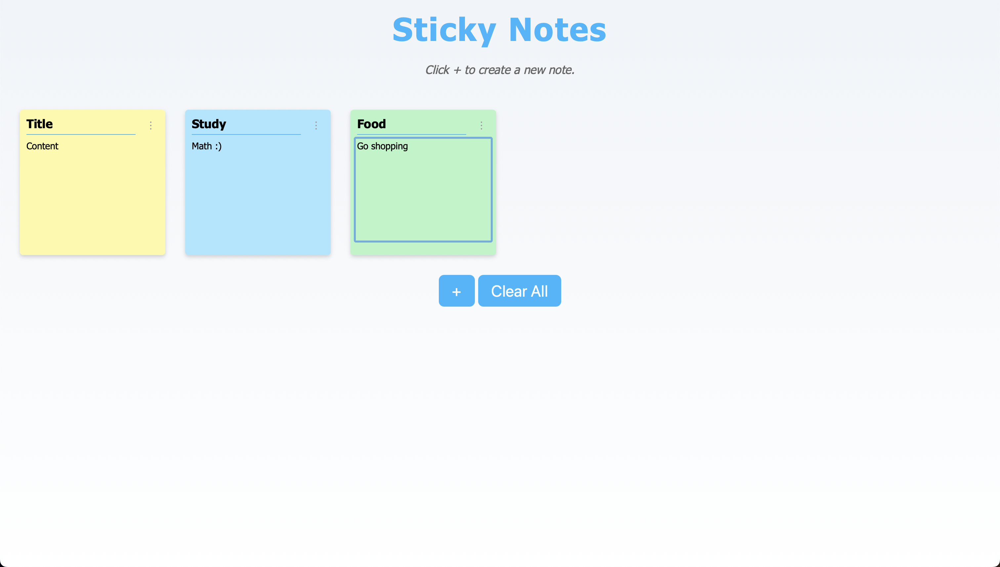

# Sticky Notes App

A simple and clean web-based sticky notes application built with HTML, CSS, and JavaScript.  
Users can create and manage digital notes directly in the browser.

## Features

- Create editable sticky notes
- Remove all notes with a single click
- Modern and responsive UI design
- Client-side functionality using plain JavaScript

## Preview

 <!-- Add screenshot here if available -->

## Technologies Used

- HTML5
- CSS3 (Flexbox)
- JavaScript (ES6)

## Contributors
- Albin Tetli
- Kai hodges